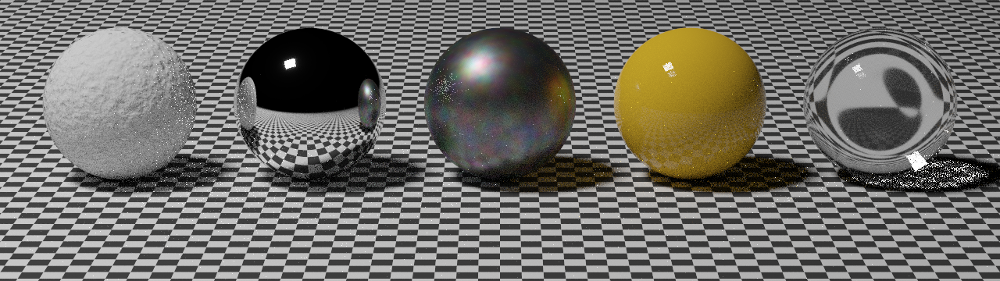

*pine* is a physical based renderer.  
Feel free to play around, open issues, or help with one of the [TODOs](#TODOs).

## Build with CMake:
```
cmake -B build
cmake --build build
```

## Example Usage:
> After rendering is finished, you should be able to find the result in `scenes/results/`
```
build/pine scenes/spheres.txt
```

/pine.git
```
build/pine scenes/cloud.txt
```


<a name="TODOs"></a>

## TODO
- [ ] Implementing reading image in bmp format in `util/fileio.cpp` (can refer `WriteImageBMP():util/fileio.cpp`)  

- [ ]  `isnan()` in `util/fileio.cpp` is implemented by a call to `__builtin_isnan()`, we should be able to do it ourself by comparing the bit pattern of the input floating-point number with bit pattern of nan number(https://docs.microsoft.com/en-us/cpp/build/ieee-floating-point-representation?view=msvc-170#nan---not-a-number)
